# DHFootball
DHFootball é um projeto da materia de laboratorio de software do curso de informatica coordenado pelo professor Paulo Helder (PH) da escola EEEP Rita matos luna, o projeto foi desenvolvido entre os alunos Alysson (Eu), Sandoval e Guilherme da terceira serie

# Docs

## DB

### MER
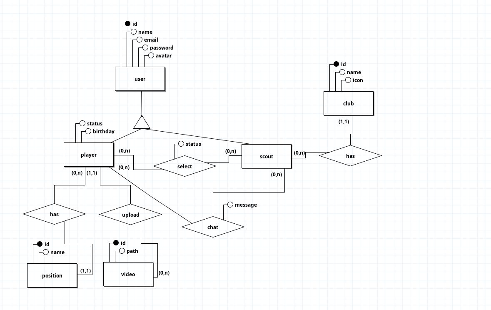

### MR
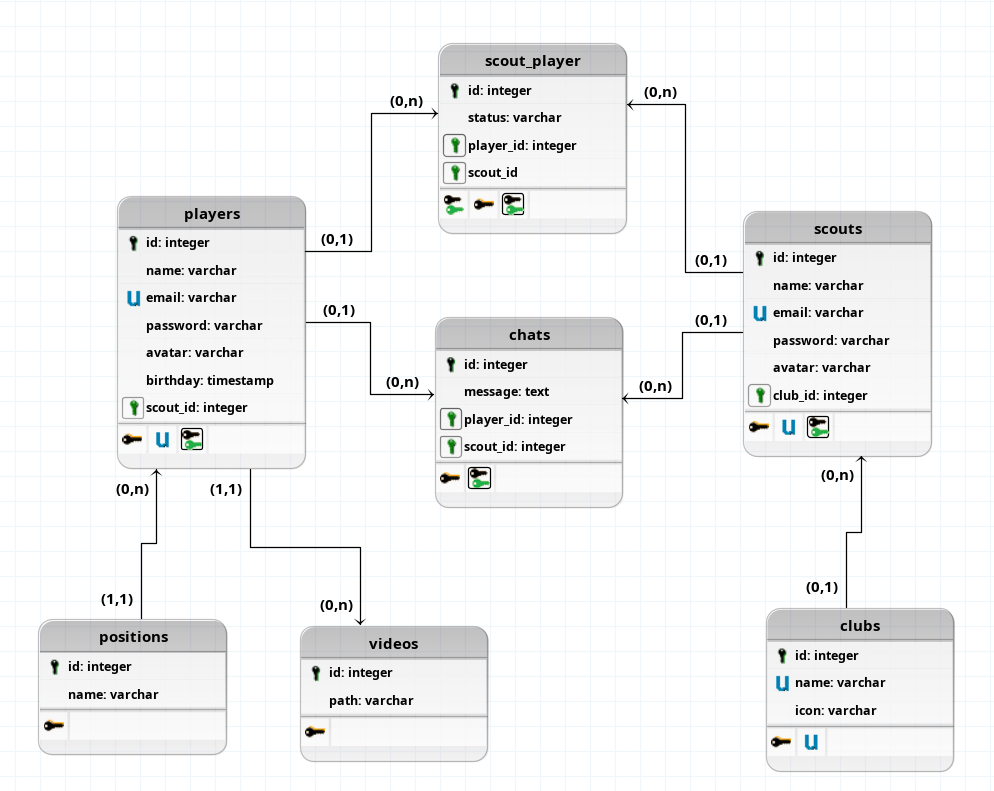

## UML

### Use Case
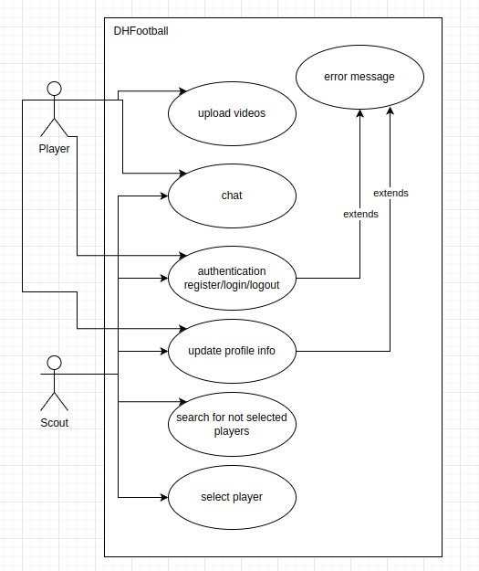

# Wireframes

## Authentication

### Player

#### Login
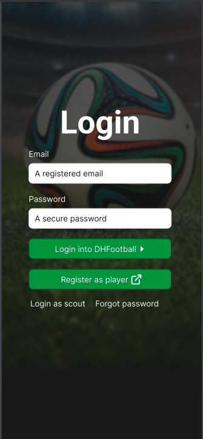

#### Register
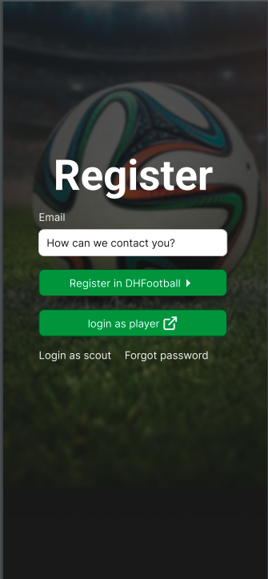

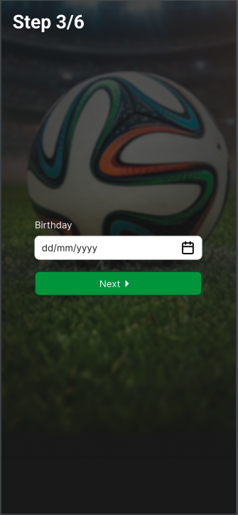
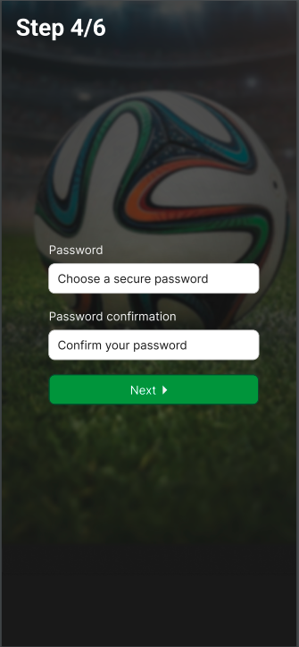

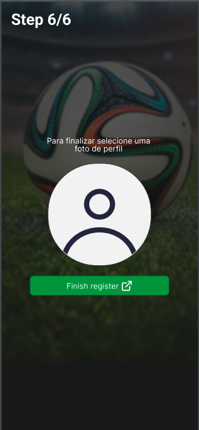

### Scout

#### Login
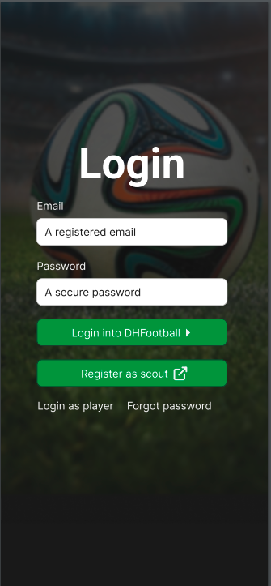

#### Register
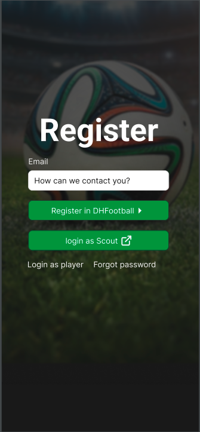
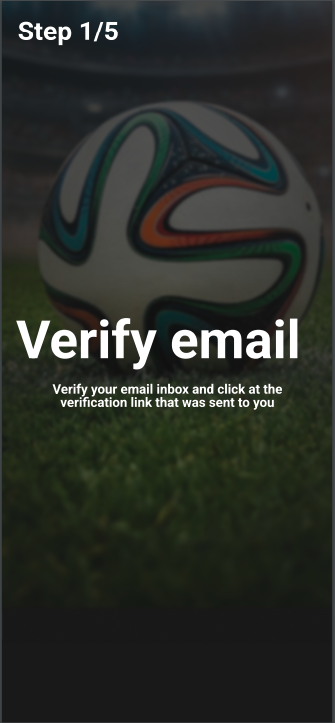
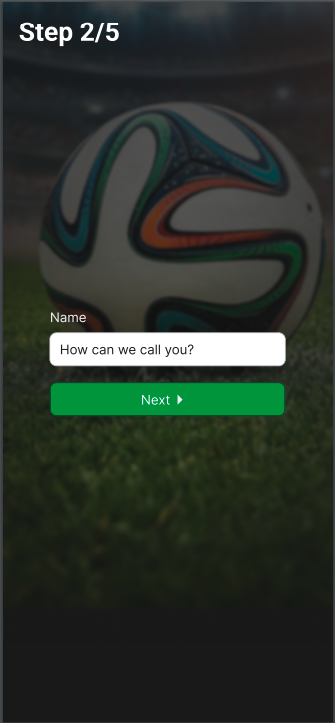
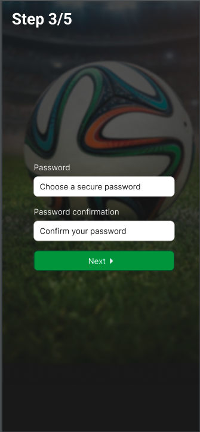
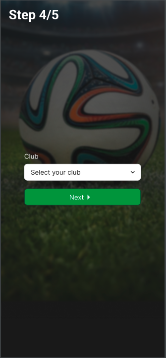
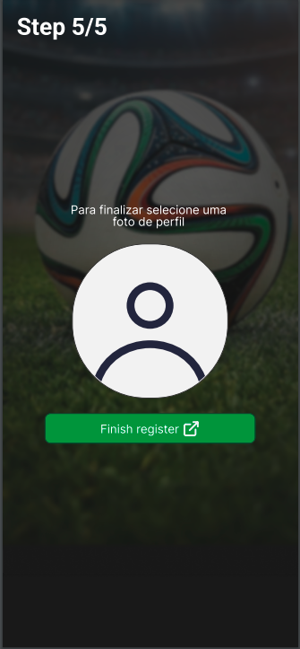

### Password
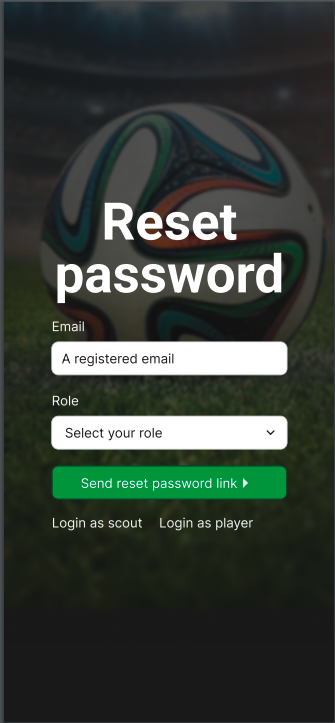

## Player

### Chat
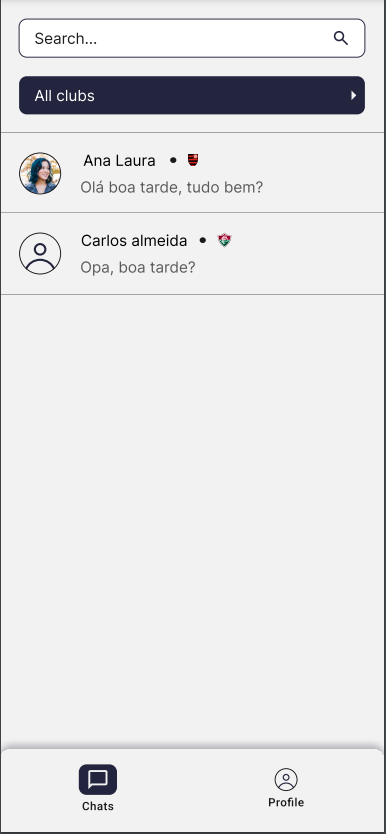
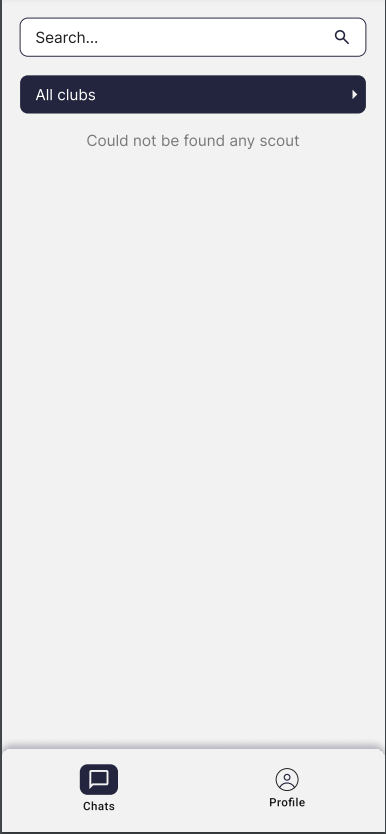
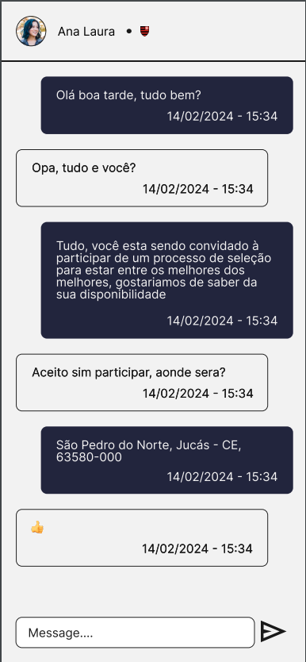
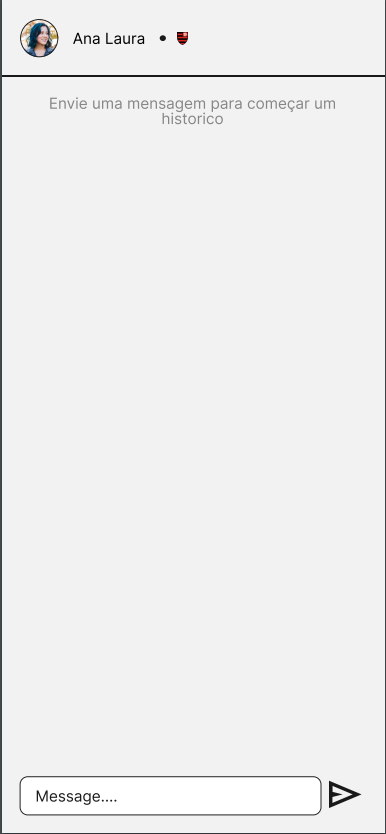

### Profile

#### Explore
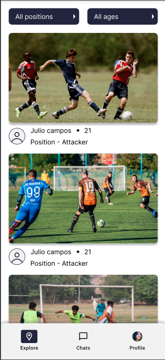
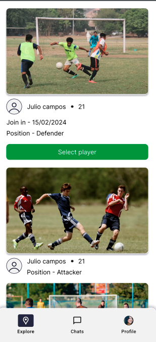
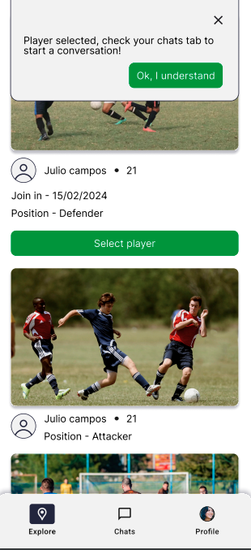

#### Chat
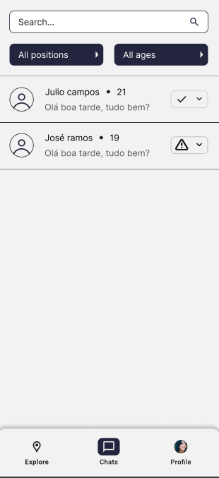
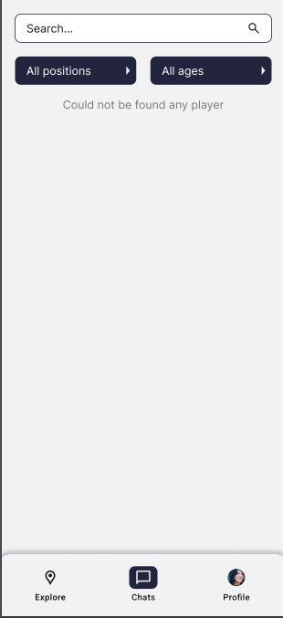
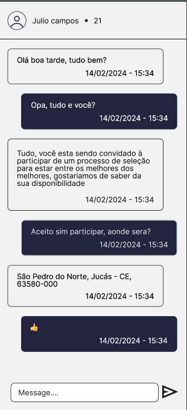
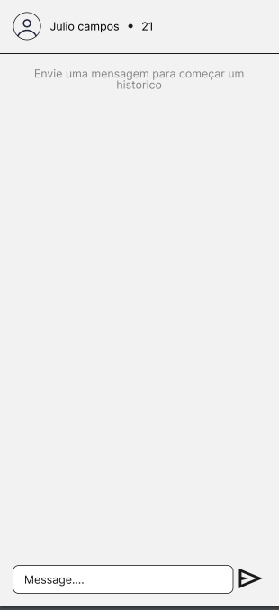

#### Profile

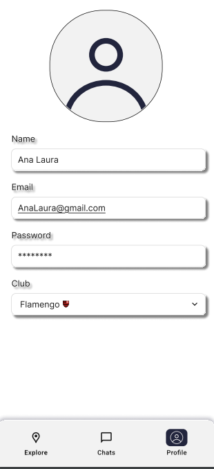
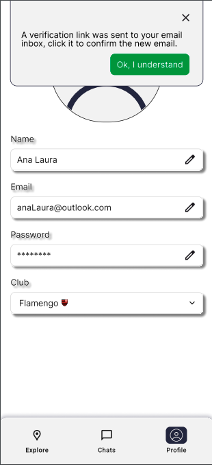
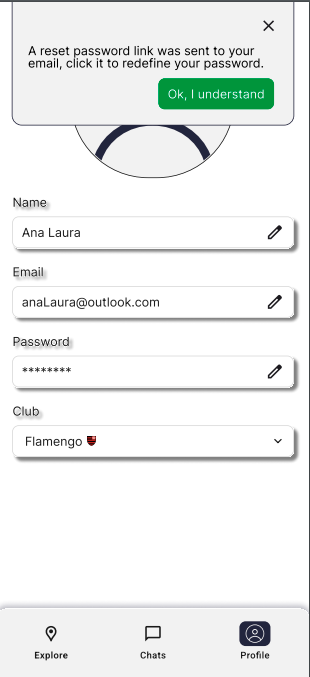