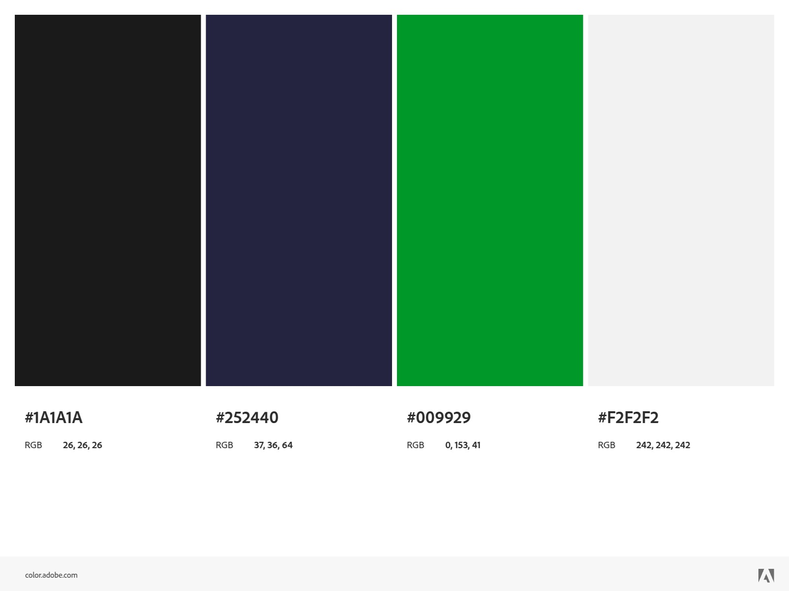
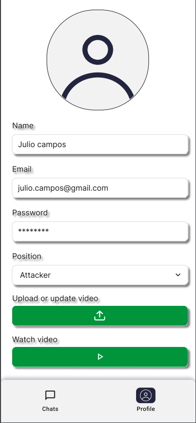
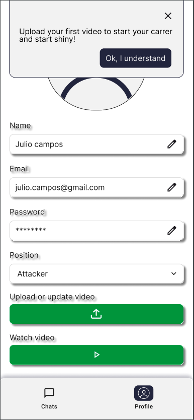
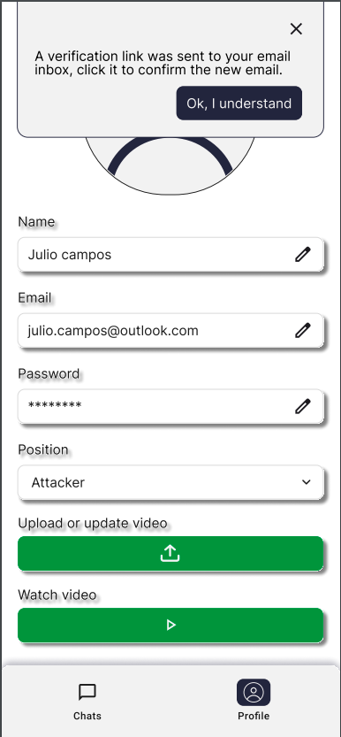

# 
DHFootball - System Design Document

## Introdução
DHFootball é um app que busca conectar jogadores de football amadores com clubes de peso, para impulsiona-los em seu inicio de carreira. O jogador ao se cadastrar precisa fazer o upload de um video curto de apresentação, mostrando suas habilidades, os olheiros em sua página inicial podem ver esses videos, filtrando por posição e idade, quando acharem um jogador pelo qual se interesem eles podem seleciona-lo e conversar com o mesmo através da aba de chats.

## Como funciona?
### Functionalidades
Como explanado no paragrafo anterior o app possui duas visões, uma do player (jogador) e uma pro scout (olheiro). Na visão do player você pode editar seu perfil, fazer upload do seu video, assistir o mesmo, ver os scouts que te selecionaram e conversar com os mesmos, na visão dos scouts você pode ver os videos dos scouts, selecionar os jogadores, conversar com os mesmos, mudar seus status entre "em analise", "selecionado", "não selecionado", e editar seu proprio perfil; alem disso em ambas as visões temos a parte de autenticação com login, cadastro e resete de senha, abaixo segue um diagrama de UseCase que representa as funcionalidades explanadas no paragrafo acima.
 

### Banco de dados
Abaixo, segue os diagramas para melhor entendimento e visualização das entidades e seus relacionamentos:

#### MER

#### MR 

## Arquitetura
A tecnologia escolhida para o desenvolvimento do app foi o laravel 11x, para fazer o build do projeto estamos usando o sail para manipular containers docker com mais praticidade, para auxiliar no frontend estamos utilizando o livewire para poder usurfruir das vantagens de uma SPA em uma aplicação monolitica feita em laravel, o banco de dados escolhido foi o MySQL por ser o padrão utilizado pela instituição que requisitou o projeto e para websocket foi utilizado o reverb, pela preferencia de uma solução self hosted, para estilização escolhemos o tailwind, por ser leve, costumizavel e ja vim configurado com o laravel 11, e para fazer o carregamento dos estilos e os scripts esta sendo utilizado o vite, pelo mesmo motivo do tailwind: ja vem configurado com o laravel

## Design
Antes de partimos para falar do design das telas de fato é importante setarmos aqui nossa paleta de cores:

- #F2F2F2 - Branco
- #009929 - Verde
- #252440 - Azul
- #1A1A1A - Preto

o Azul foi escolhido por ser uma cor geralmente associado á uma solução tecnologica, o tom escuro para contrastar com o verde claro, que por sua vez foi escolhido por ser uma cor geralmente associado ao football, abaixo, segue as imagens das telas do app com uma breve descrição de cada uma

### Login do jogador

A tela de login do jogador possui 4 botões, "Login as scout" para entrar como um olheiro, "Register as player" para se cadastro caso ainda nao esteja cadastrado e "Forgot password" redireciona para uma pagina de "Esqueci minha senha" que pode ser usada para resetar a senha tanto do jogador, tanto do olheiro. A tela possui dois inputs, um de email e um de senha, ao inserir os dados corretamente você sera redirecionado para a tela de "profile" do player ja autenticado

### Cadastro do jogador

A tela de registro, assim como a de login possui 4 botões, todos fazem a mesma coisa que os da tela anterior, com exceção de um, "Login as player" redireciona de volta para a tela de login do jogador. A tela de registro possui apenas um input de email, ao inserir um email valido você sera redirecionado para o proximo passo do cadastro, que possui um total de 6 passos.

Quando você for redirecionado para essa tela, você deve checar a caixa de entrada do email fornecido na tela anterior e clicar no link de veririfcação para validar seu email assim como instruido na tela.

Ao validar o email você sera redirecionado para a proxima tela, onde deve inserir um username valido.

A tela seguinte você deve inserir sua data de aniversario, para conseguirmos usar sua idade para filtragem na tela de "explore" dos scouts

Aqui foi cria uma senha e repete ela no input de baixo.

Aqui você seleciona sua posição como jogador, que pode ser atacante, zagueiro, lateral, e entre outras posições, ps: eu não entendo de football

E aqui você seleciona sua foto de perfil e finaliza seu cadastro e é redirecionado para a tela de "profile" ja autenticado.

### Login do scout

Funciona assim como a tela de login dos players, porem ao em vez de "Register as player" tem o botão "Register as scout" que redireciona para o cadastro de scout, e "Login as player" que redireciona para o login de jogador

### Cadastro do scout

Funciona assim como o cadastro do jogador porem sem o campo de birthday, ao em vez disso se tem o campo de "club", para o olheiro (scout) dizer o clube q ele representa, como flamengo, fluminense ou coritias por exemplo.

### Esqueci a senha

Caso o usuario esqueça a senha ele pode reseta-la através dessa tela, o campo email deve ser preenchido com o email onde deve chegar o link de redefinição de senha, e o campo role deve ser inserido o cargo da conta (scout ou player).

### Perfil do jogador

Tela de perfil do jogador, aqui podem ser editadas todas as informações do jogador, fazer upload ou reupload do video de apresentação, e tambem assistir o mesmo.

Tela de perfil do jogador assim q faz o registro pela primeira vez, a notificação alerta o jogador de que ele deve fazer o upload do video de apresentação de forma obrigatoria.

Tela de perfil quando você tenta editar seu email, a notificação que aparece le alerta q foi enviado um email de confirmação para o novo email com um link de verificação para alteração do endereço eletronico de contato.

Tela de perfil de quando você tenta editar sua senha, a notificação le alerta do email de reset de senha que foi enviado em seu email atual.

### Chat do jogador

Nessa tela aparecem todos os olheiros que tem você como analise, você pode filtra-los por clubes quando você é selecionado em definitivo todos eles somem, e fica somente o que selecionou você em definitivo. quando ninguem lhe deu uma chance ainda a sua tela de chats fica que nem a ultima imagem, com um alerta de que não foi possivel encontrar nenhum olheiro. 

### Pagina de explore

Nessa tela de explore você pode achar um jogador perfeito para você você, filtrando por posição e idade, ao clicar em um video e ser redireciona para a tela de "assistir" você ira notar um botão de "select player", ao clica-lo, o jogador sera enviado para a tela de chats com o status inicial de em analise, a notificação q ira aparecer dira "Jogador selecionado, cheque a tela de chats e inicie uma conversa".

### Pagina de chats dos olheiros

Na tela de ver os jogadores com os quais você esta conversando você pode mudar o status deles entre selecionado, em analise e não selecionado, ao escolher "selecionado" ele sumira da pagina de explore para todos os outros olheiros, e da pagina de chats do olheiros q tinham ele como em analise, você pode filtrar para que aparecem so os jogadores de certa posiçao ou idade, alem de poder pesquisar por nome, ou posiçao

### Perfil do scout

Essas funcionam exatamente como a tela de perfil dos jogadores, porem com os campos do scout.

## Futuras implementações

Se ao finalizar tudo que planejamos, antes do final do prazo, pretendemos implementar algumas funcionalidades a mais para os jogadores, elas estão listadas abaixo em ordem de prioridade:

- Pretendemos implementar uma funcionalidade onde eles poderam enviar mais de um video, porem teram que pagar uma taxa para cada video enviado após o primeiro, isso podera ajudar na visibilidade dos mesmos, alem disso. 
- Pretendemos adicionar a possibilidade de os jogadores escolherem uma thumbnail para seus videos, e não depender somente da thumb automatica

## Considerações finais
Este documento não fazia parte dos requisitos de entrega, ele foi escrito por pura e espontanea vontade minha exclusivamente, com a intenção de melhor minha escritade documentos de System Design.

---
SDD - Made By "Alysson Chrysthian Pereira Chaves"

