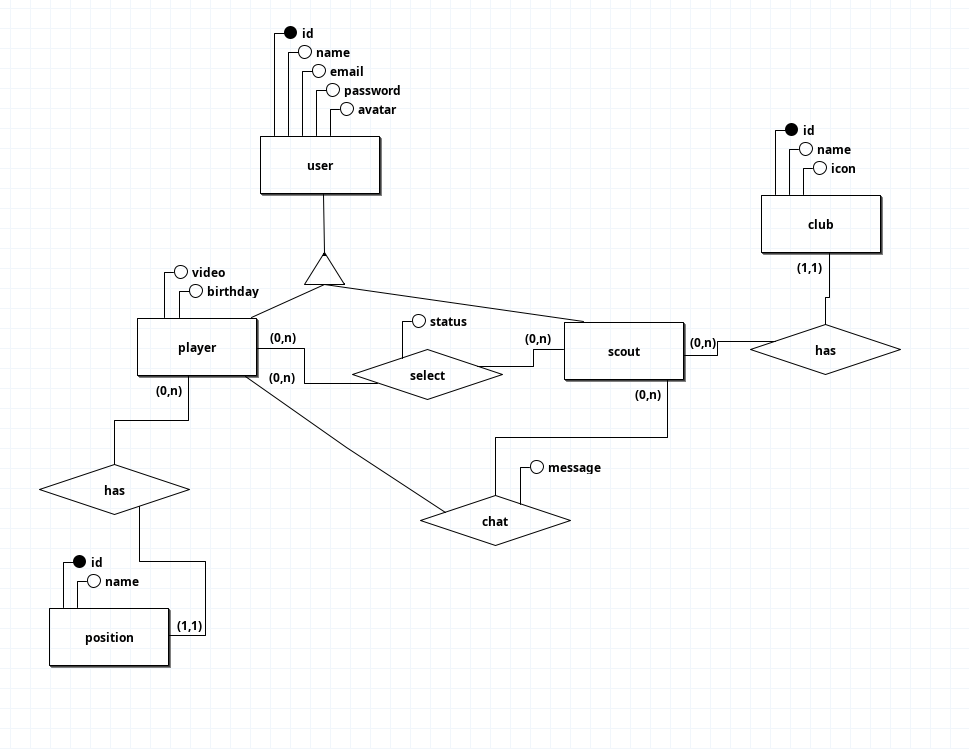

# <center>DHFootball - System Design Document</center>

## Introdução
DHFootball é um app que busca conectar jogadores de football amadores com clubes de peso, para impulsiona-los em seu inicio de carreira. O jogador ao se cadastrar precisa fazer o upload de um video curto de apresentação, mostrando suas habilidades, os olheiros em sua página inicial podem ver esses videos, filtrando por posição e idade, quando acharem um jogador pelo qual se interesem eles podem seleciona-lo e conversar com o mesmo através da aba de chats.

## Como rodar?
O DHFootball roda em ambiente docker se utilizando do sail, após clonalo em sua maquina rode o seguinte comando no seu terminal

```ruby
composer install
```
com isso o sail deve ser instalado no vendor da aplicação, para usa-lo digite

```ruby
vendor/bin/sail up -d --build
```
quando a aplicação for buildada, rode as migrations e prepare seu banco de dados com os comandos

```ruby
vendor/bin/sail artisan migrate
vendor/bin/sail artisan db:seed
```
após isso basta ativar as queues do laravel para que certas funcionalidades possam ser executados da maneira correta, você faz isso rodando

```ruby
vendor/bin/sail artisan queue:work
```
com isso basta configurar o servidor websockets, pra isso sera necessario criar uma aplicação no pusher e adicionar as informações dela no .env da aplicação que deve ser criado com base no .env.example

## Como funciona?
### Functionalidades
Como explanado no paragrafo anterior o app possui duas visões, uma do player (jogador) e uma pro scout (olheiro). Na visão do player você pode editar seu perfil, fazer upload do seu video, assistir o mesmo, ver os scouts que te selecionaram e conversar com os mesmos, na visão dos scouts você pode ver os videos dos scouts, selecionar os jogadores, conversar com os mesmos, mudar seus status entre "em analise", "selecionado", "não selecionado", e editar seu proprio perfil; alem disso em ambas as visões temos a parte de autenticação com login, cadastro e resete de senha, abaixo segue um diagrama de UseCase que representa as funcionalidades explanadas no paragrafo acima.
 

### Banco de dados
Abaixo, segue os diagramas para melhor entendimento e visualização das entidades e seus relacionamentos:

#### MER


#### MR 


## Arquitetura
A tecnologia escolhida para o desenvolvimento do app foi o laravel 12x, para fazer o build do projeto estamos usando o sail para manipular containers docker com mais praticidade, para auxiliar no frontend estamos utilizando o livewire para poder usurfruir das vantagens de uma SPA em uma aplicação monolitica feita em laravel, o banco de dados escolhido foi o MySQL por ser o padrão utilizado pela instituição que requisitou o projeto e para websocket foi utilizado o reverb, pela preferencia de uma solução self hosted, para estilização escolhemos o tailwind, por ser leve, costumizavel e ja vim configurado com o laravel 11, e para fazer o carregamento dos estilos e os scripts esta sendo utilizado o vite, pelo mesmo motivo do tailwind: ja vem configurado com o laravel

## Design
Antes de partimos para falar do design das telas de fato é importante setarmos aqui nossa paleta de cores:

- #F2F2F2 - Branco
- #009929 - Verde
- #252440 - Azul
- #1A1A1A - Preto


o Azul foi escolhido por ser uma cor geralmente associado á uma solução tecnologica, o tom escuro para contrastar com o verde claro, que por sua vez foi escolhido por ser uma cor geralmente associado ao football.

## Futuras implementações

Se ao finalizar tudo que planejamos, antes do final do prazo, pretendemos implementar algumas funcionalidades a mais para os jogadores, elas estão listadas abaixo em ordem de prioridade:

- Pretendemos implementar uma funcionalidade onde eles poderam enviar mais de um video, porem teram que pagar uma taxa para cada video enviado após o primeiro, isso podera ajudar na visibilidade dos mesmos, alem disso. 
- Pretendemos adicionar a possibilidade de os jogadores escolherem uma thumbnail para seus videos, e não depender somente da thumb automatica

## Considerações finais
Este documento não fazia parte dos requisitos de entrega, ele foi escrito por pura e espontanea vontade minha exclusivamente, com a intenção de melhor minha escritade documentos de System Design.

---
SDD - Made By "Alysson Chrysthian Pereira Chaves"

